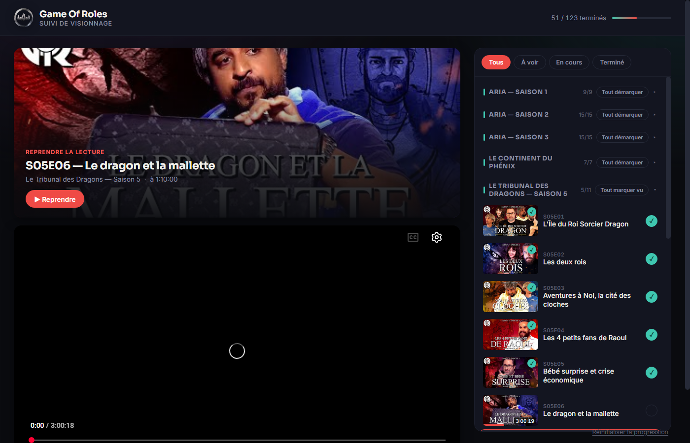
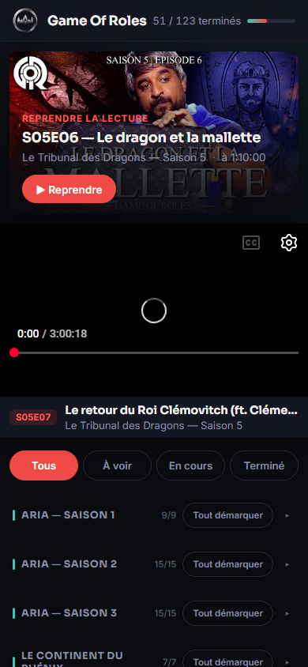

# 🎲 Game Of Roles — Suivi de visionnage

Outil personnel pour regarder ***Game Of Roles*** (Fibretigre & Mister MV) **dans l'ordre**
et **reprendre exactement là où on s'est arrêté**.

La partie de JDR filmée compte des centaines d'heures réparties sur plusieurs
chaînes YouTube (Madmoizelle, Fibretigre, Mister MV), sans playlist unique
fiable. Cette app réunit tous les épisodes dans un seul écran, dans l'ordre
chronologique de l'histoire, et retient automatiquement la position de lecture.

<p align="center">
  
  
</p>

## Fonctionnalités

**Suivi de visionnage**
- **141 épisodes** dans l'ordre chronologique (2018 → aujourd'hui), groupés par arc :
  Aria (S1–S3), Le Continent du Phénix, Le Tribunal des Dragons (S5–S7), Justice,
  Galaxies, Valenthia, Sheol, Justice 1937, Odyssée.
- **Lecteur YouTube intégré** : la position est sauvegardée toutes les 5 secondes.
- **Reprise en un clic** : un bandeau « Reprendre la lecture » propose l'épisode en cours, à la seconde près.
- **Épisode terminé automatiquement** à 95 % de visionnage.
- **Marquage manuel « vu »** : une case par épisode, et « Tout marquer vu » par saison pour rattraper ce qu'on a déjà regardé ailleurs.
- **Filtres** Tous / À voir / En cours / Terminé, sections repliables avec compteur (`9/15`) et progression globale dans l'en-tête.
- **Section « Hors-série »** à part (crossovers, spéciaux, récaps) : suivie comme le reste, mais non comptée dans la progression de la trame principale.
- **100 % local** : la progression est stockée dans le navigateur ou l'app, aucun compte, aucun serveur.

**Application Android**
- APK installable, plein écran vidéo, bouton retour géré.
- **Mise à jour intégrée** : bouton « Mettre à jour » qui télécharge la dernière version depuis GitHub et ouvre l'installateur.
- **Vérification automatique une fois par mois** : si une nouvelle version existe, un bandeau le signale (avec « Plus tard » pour le masquer). Une mise à jour repérée reste signalée tant qu'elle n'est pas installée.

**Ergonomie mobile**
- Le lecteur reste épinglé en haut pendant qu'on fait défiler la liste.
- Grandes zones tactiles, en-tête compact, mode paysage plein écran pour la vidéo.

## Installer sur Android

1. Ouvre la [dernière release](https://github.com/nauno40/GameOfRoles/releases/latest) depuis ton téléphone.
2. Télécharge `GameOfRoles.apk` et ouvre-le (Android demande d'autoriser l'installation depuis cette source).
3. Les mises à jour suivantes se font depuis l'app.

## Utiliser dans un navigateur

Le lecteur YouTube a besoin d'être servi en HTTP (pas en `file://`). Depuis ce dossier :

```bash
python3 -m http.server 8080
```

puis ouvrir http://localhost:8080/. L'app est aussi installable comme PWA
(manifeste + service worker).

## Structure du projet

| Fichier | Rôle |
|---|---|
| [`index.html`](index.html), [`style.css`](style.css) | Interface (responsive, thème sombre) |
| [`app.js`](app.js) | Lecteur, sauvegarde de progression, filtres, mise à jour Android |
| [`episodes.js`](episodes.js) | Liste des épisodes (arc, ID YouTube, code, titre, date) |
| [`manifest.json`](manifest.json), [`service-worker.js`](service-worker.js) | PWA |
| [`android/`](android/) | Wrapper Android : `WebView` native minimale, sans Gradle ni dépendance |
| [`build-apk.sh`](build-apk.sh) | Construit et signe `dist/GameOfRoles.apk` |

Pas de build, pas de framework : HTML/CSS/JS pur. Aucune clé API YouTube n'est
nécessaire, la liste d'épisodes est curatée à la main.

## Données : d'où viennent les épisodes

Liste sourcée et recoupée depuis :
- la playlist officielle *« GAME OF ROLES : Jeu de rôle »* de la chaîne **mistermv** (saisons 5 à 10) ;
- le wiki communautaire [gameofroles.wiki](https://gameofroles.wiki) (Aria S1–S3, Phénix, diffusés à l'origine sur la chaîne Madmoizelle) ;
- [TheTVDB](https://thetvdb.com/series/game-of-roles) pour la structure des saisons et les dates.

Chaque ID vidéo a été vérifié individuellement (titre + disponibilité).

**Ajouter un épisode** (la partie continue, arc *Odyssée* en cours) : ajouter une
ligne à la fin de [`episodes.js`](episodes.js) avec l'ID YouTube (ce qui suit `v=`
ou `youtu.be/`), le code, le titre et la date. Pour un hors-série, ajouter
`bonus: true` avec `arc: "Hors-série"`.

## Construire et publier l'APK

Prérequis : JDK 17 et SDK Android (platform 34, build-tools 34.0.0) dans `~/android-build`.

```bash
echo "1.4 5" > android/version      # nom de version, code de version
./build-apk.sh                        # → dist/GameOfRoles.apk
gh release create v1.4 dist/GameOfRoles.apk
```

L'APK est signé avec `~/android-build/gor.keystore` (créée au premier build).
**Conserver cette clé** : Android refuse d'installer une mise à jour signée avec
une autre clé.

## Idées non implémentées

- Export/import de la progression pour changer d'appareil
- Détection automatique des nouveaux épisodes (nécessiterait la YouTube Data API)

---

Projet de fan, non officiel. *Game Of Roles*, ses logos et ses vidéos appartiennent
à leurs auteurs (Fibretigre, Mister MV et leurs équipes) ; les vidéos sont lues
depuis YouTube via le lecteur intégré officiel.
